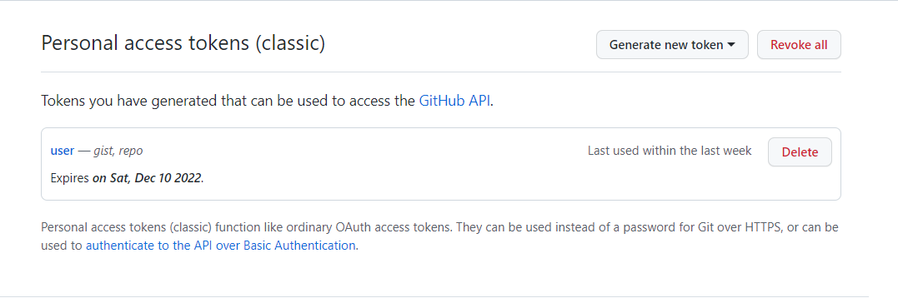
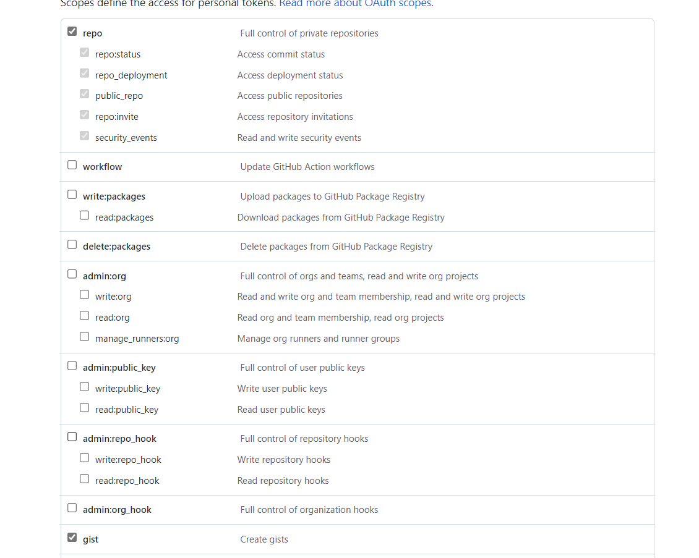
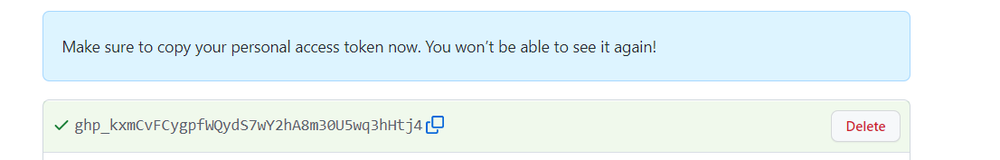
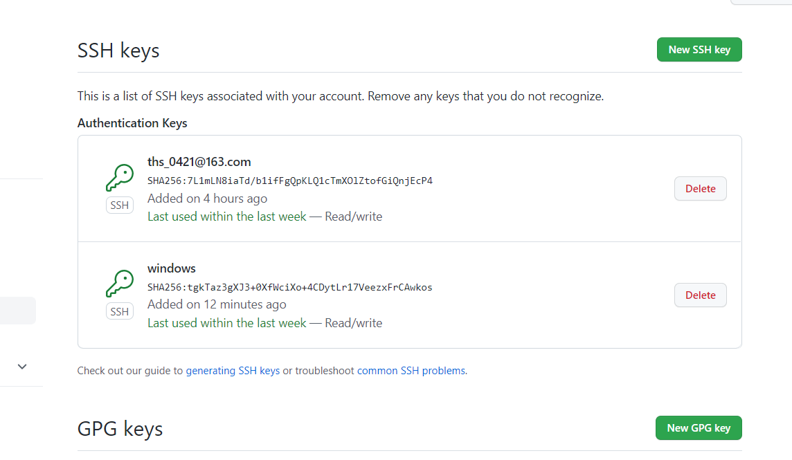
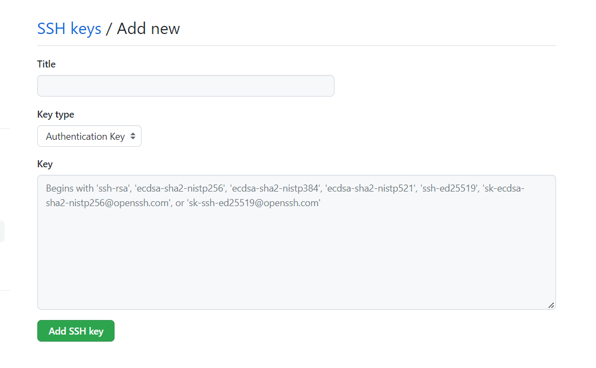

## Github - git

### （一）创建 Github 远程仓库

**1.settings 获取 token**

(1) 点击头像 settings

(2) 点击 Developer settings

(3) 点击 personal access tokens

  

  

(4) 生成 token 

  

该 token 可以使用一段时间，过期后得重新生成

---
**2.git 命令 创建远程仓库**
```shell
curl -u 'TUTU-Jack:token' https://api.github.com/user/repos -d '{"name":"'Repository name'"}'
```
---

### （二）创建 Github 本地仓库

**SSH密钥配置**

git 连接github时可以使用 HTTP 或者 SSH，使用SSH更安全且方便

（1）主机本地生成SSH密钥
```shell
ssh-keygen -t rsa -C "your_email@example.com"
```
+ 公钥 - id_rsa.pub

+ 私钥 - id_rsa

需要在其它服务器中远程连接本地时，使用公钥，私钥自己保存

（2）打开公钥所在文件，复制公钥

（3）登录 github 设置密钥

  


  

将复制的公钥复制到 Key 中，创建连接

（4）查看是否连接成功
```shell
ssh -T git@github.com
```
---
**1.本地配置**
```shell
git config --global user.name "user name"
git config --global user.email "user emial"
```

**2.将本地文件夹变成本地仓库**
```shell
# 初始化本地仓库
git init

# 本地仓库连接远程仓库
git remote add <远程仓库地址别名> <远程仓库链接>

git remote add github git@github.com:TUTU-Jack/github.git

# 查看本地连接远程仓库
git remote -v

# 删除远程仓库
git remote rm <远程仓库地址别名>
```
**3.上传本地文件到本地仓库**
```shell
# 添加文件到缓存区
git add <文件名/文件夹名>

# 添加所有文件到缓存区
git add .

# 将缓存区文件上传到本地仓库
git commit -m "修改描述"

# 撤销上传
git commit --amend

# 查看上传文件修改状态
git status

# 若文件有修改，则需将修改后的文件重新上传

# 查看提交记录
git log

# 查看哪些文件做了什么修改
git diff

```
**4.将本地仓库文件上传到远程仓库**
```shell
# 将本地仓库上传到远程仓库的某个分支
git push <远程仓库地址别名> <分支名>
```

**5.将远程仓库拉到本地仓库**
```shell
git pull <远程仓库地址别名> <分支名>
```
---
**6.创建新分支**
```shell
# 创建本地仓库新分支
# 切换到某一分支下
git checkout <分支名>

# 在该分支下创建新分支，并切换到该新分支
git checkout -b <分支名>

# 删除本地仓库分支，必须切换到删除分支的上一级
git branch -D <分支名>

# 查看本地分支结构
git branch

# push 本地仓库到远程仓库
git push <远程仓库地址别名> <新建分支名>

# 删除远程仓库分支
git push <远程仓库地址别名> --delete <分支名>
```
---